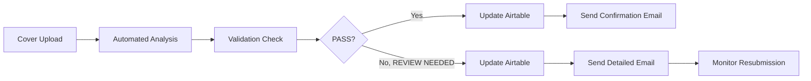

# Automated Book Cover Validation System

This repository contains a lightweight, self-contained prototype for the BookLeaf Publishing cover validation workflow.

## Processing Flow



## What it does

- Validates cover geometry against the required safe area rules
- Flags overlap risk between author names and the award badge zone
- Checks border spacing, basic alignment heuristics, and image size/quality signals
- Produces structured results for Airtable and email automation
- Includes a local demo runner and unit tests

## Run the demo

```bash
python3 -m bookleaf_validation.cli demo
```

## Run a strict batch

```bash
python3 - <<'PY'
import os
os.environ['DRY_RUN'] = 'true'
from bookleaf_validation.cli import batch_validate
raise SystemExit(batch_validate('validation_book_covers'))
PY
```

## Run tests

```bash
python3 -m unittest discover -s tests
```

## Submission Artifacts

- `RUNBOOK.md`
- `ACCURACY_REPORT.md`
- `validation_book_covers/batch_report.json`
- `validation_book_covers/batch_report.csv`
- `validation_book_covers/accuracy_metrics.json`

## Accuracy Note

The included accuracy report is a strict sample-set validation, not a formal benchmark on a labeled ground-truth corpus. It demonstrates that the pipeline correctly passes a clean high-resolution cover and routes lower-quality sample covers to `REVIEW NEEDED` under strict rules.

## Notes

- The core geometry checks are fully implemented.
- PNG dimensions are read without external libraries.
- PDF rasterization and OCR are intentionally adapter-based so the pipeline can be connected to a production OCR/image service.
