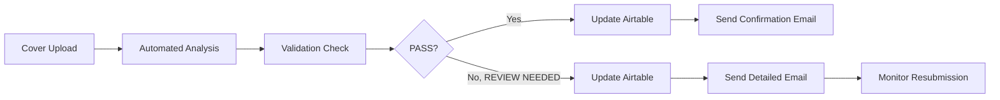

# System Architecture

## Workflow

1. A file lands in the monitored Google Drive folder.
2. The watcher reads the filename, extracts the ISBN, and looks up author metadata.
3. The validator applies layout rules:
   - Safe area margins
   - Award badge exclusion zone
   - Border spacing checks
   - Image quality signals
4. Results are written to Airtable.
5. A status-specific email is generated:
   - `PASS` => confirmation email
   - `REVIEW NEEDED` => detailed correction email
6. The system monitors the resubmission loop until the cover passes.

## Core Modules

- `bookleaf_validation.validators`
  - Business rules and confidence scoring
- `bookleaf_validation.integrations`
  - Airtable and email adapters
- `bookleaf_validation.image_io`
  - PNG header parsing and quality signals
- `bookleaf_validation.cli`
  - Local demo runner

## Production Extension Points

- Replace the `elements` input with OCR results from your chosen vision service.
- Replace the stub Airtable client with a live API client.
- Replace the email composer with SendGrid, Gmail API, or AWS SES.
- Add a PDF rasterization backend for production PDF validation.
